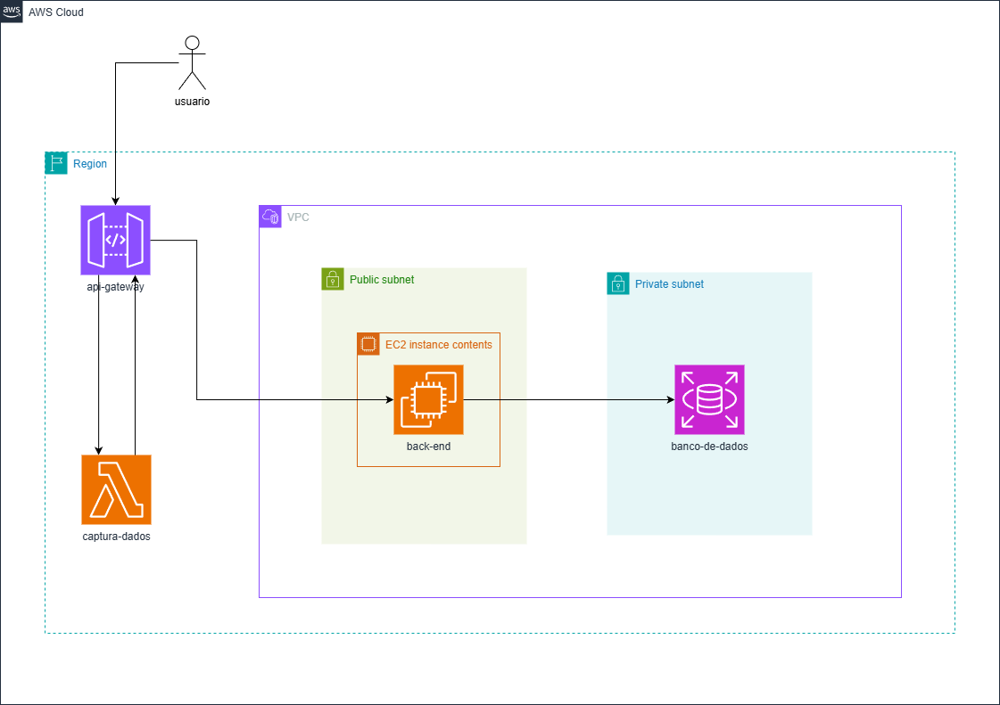

# Projeto Integrador – Cloud Developing 2025/1

> CRUD simples + API Gateway + Lambda /report + RDS + CI/CD

**Grupo**:

1. 10420319 - Jean Pazzini Domingues - Documentação + Lambda
2. 10420439 - Matheus Fernandes dos Santos - VPC + RDS + Back-End + API Gateway + Video

## 1. Visão geral
O projeto consiste na implementação de um sistema de back-end para o gerenciamento de produtos. 
O domínio escolhido, um CRUD (Create, Read, Update, Delete) de produtos, é um caso de uso fundamental e amplamente aplicável, ideal para demonstrar a integração de diversos serviços em nuvem de forma clara e objetiva. 
A aplicação permite realizar as operações básicas de cadastro, consulta, atualização e exclusão de produtos por meio de uma API REST. 
Além das funcionalidades CRUD, o sistema expõe um endpoint /report que utiliza uma função serverless (AWS Lambda) para gerar estatísticas sobre os produtos cadastrados, demonstrando um padrão de arquitetura desacoplado e escalável. 
O principal objetivo é aplicar os conhecimentos da disciplina de Cloud Developing, construindo uma arquitetura robusta e moderna na AWS.

## 2. Arquitetura



| Camada | Serviço | Descrição                             |
|--------|---------|---------------------------------------|
| Backend | EC2 + Docker | API REST Spring                       |
| Banco   | Amazon RDS   | PostgreSQL em subnet privada          |
| Gateway | Amazon API Gateway | Rotas CRUD → ECS · `/report` → Lambda |
| Função  | AWS Lambda   | Consome a API, gera estatísticas JSON |

## 3. Como rodar localmente

```bash
cp .env.example .env         # configure variáveis
docker compose up --build
# API em http://localhost:8080
# Obs. Não vai se conectar com o banco de dados pois ele está numa rede privada da nuvem